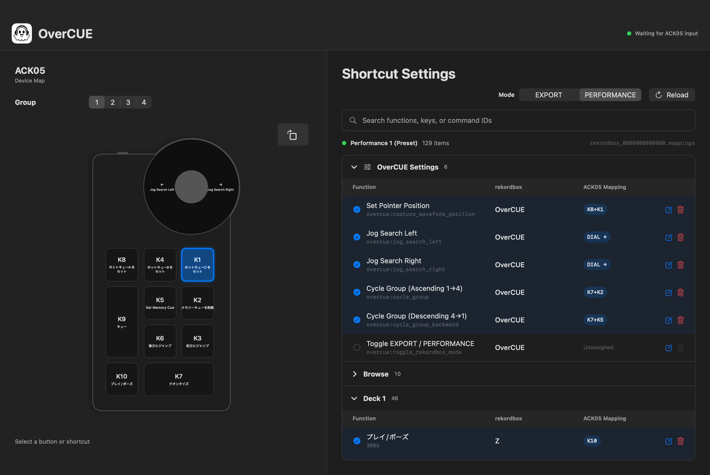

<nav class="language-nav"><a href="../../macos/">日本語</a> ・ English ・ <a href="../../zh-hans/macos/">简体中文</a></nav>
<nav class="platform-nav"><a href="../">Overview</a><span>・</span><strong>macOS</strong><span>・</span><a href="../windows/">Windows</a></nav>

# OverCUE for macOS

<p class="hero-lede">Map the ACK05 dial and ten keys to Cue, Hot Cue, Jump, Quantize, and waveform controls in rekordbox. The universal app supports both Apple Silicon and Intel Macs.</p>



## Requirements

| Item | Requirement |
| --- | --- |
| OS | macOS 13 Ventura or later |
| Mac | Apple Silicon or Intel |
| Device | XPPen ACK05 Wireless Shortcut Remote |
| DJ software | rekordbox 7 |

## Download and first launch

1. Download `OverCUE-vX.Y.Z-macos-universal.zip` from [GitHub Releases](https://github.com/albasimia/OverCUE/releases/latest).
2. Extract the ZIP and move `OverCUE.app` to Applications.
3. Open OverCUE once so macOS displays its warning.
4. Open System Settings → Privacy & Security, then select Open Anyway for OverCUE.
5. Select Open again in the confirmation dialog.

<div class="notice">The macOS build is not signed with Developer ID or notarized by Apple. You do not need to disable Gatekeeper globally or remove quarantine attributes with <code>xattr</code>.</div>

## Permissions

Allow the following under Privacy & Security, then quit and reopen OverCUE:

- Input Monitoring, to receive ACK05 key and dial events
- Accessibility, to send keyboard and mouse actions to rekordbox

Quit XPPenPenTablet if it consumes ACK05 input before OverCUE receives it.

## Basic usage

1. Launch rekordbox.
2. Connect the ACK05 and launch OverCUE.
3. Select a group and EXPORT or PERFORMANCE mode.
4. To use waveform dragging, place the pointer over rekordbox's enlarged waveform and press `K8+K1` to save that position.
5. Bring rekordbox to the foreground and operate the ACK05.

Keyboard and mouse output is enabled only while rekordbox is in the foreground. Closing the window leaves OverCUE running in the menu bar.

If the selected rekordbox shortcut file is missing, OverCUE falls back to `Performance 1 (Preset)` or `Export (Preset)`. It does not guess when the required function has no shortcut.

## Groups and modes

| Group | Initial mode | Target |
| --- | --- | --- |
| 1 | PERFORMANCE | Deck 1 |
| 2 | PERFORMANCE | Deck 2 |
| 3 | EXPORT | Deck 1 |
| 4 | EXPORT | User configuration |

Each group remembers its last mode and waveform position.

## Default key map

| Input | Action |
| --- | --- |
| K1 / K4 / K8 | Hot Cue C / B / A |
| K2 / K5 | Delete / set Memory Cue |
| K3 / K6 | Jump forward / backward, accelerating while held |
| K7 | Quantize on/off |
| K9 / K10 | Cue / Play-Pause |
| Dial left / right | Jog Search left / right |
| K8+K1 | Save waveform position |
| K7+K8 / K4 / K1 | Delete Hot Cue A / B / C |
| K7+K3 / K6 | Next / previous Memory Cue |
| K7+K2 / K5 | Next / previous group |
| K7+dial left / right | Pitch Bend − / + |

Group 2 uses the same physical layout for Deck 2. Group 4 starts empty.

## Edit key mappings

Press the edit button in the shortcut list, then enter an ACK05 key, a key combination, a dial event, or a dial event while holding a key.

- Assigned rekordbox shortcuts are grouped into collapsible categories.
- Search by function name, key, or commandId.
- Replacing an existing input requires confirmation.
- Device buttons scroll to their shortcut; selecting a shortcut highlights the device button.
- Rotate the device diagram in 90-degree steps and save its orientation.

## Language and configuration

The window and menu bar support Japanese, English, and Simplified Chinese. Select a language from OverCUE → Settings.

```text
~/Library/Application Support/OverCUE/config.json
```

## Troubleshooting

### ACK05 input does not appear

- Verify Input Monitoring permission and reopen OverCUE.
- Quit XPPenPenTablet.
- Disconnect and reconnect the ACK05.

### rekordbox does not respond

- Bring rekordbox to the foreground.
- Check the group and EXPORT/PERFORMANCE mode.
- Verify Accessibility permission.
- Select Reload in OverCUE after changing rekordbox settings.

## Privacy and safety

OverCUE has no telemetry, advertising, accounts, or automatic uploads. Configuration and UI state remain on your Mac. You can verify the public source and `SHA256SUMS.txt` from each release.

[Back to the overview](../) · [Windows setup guide](../windows/)
