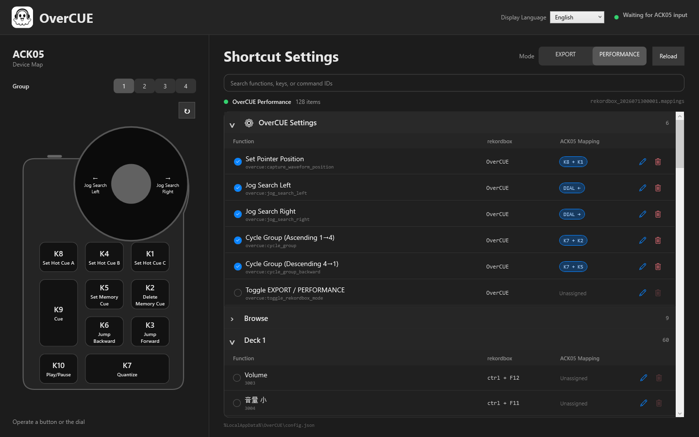

<nav class="language-nav"><a href="../../windows/">日本語</a> ・ English ・ <a href="../../zh-hans/windows/">简体中文</a></nav>
<nav class="platform-nav"><a href="../">Overview</a><span>・</span><a href="../macos/">macOS</a><span>・</span><strong>Windows</strong></nav>

# OverCUE for Windows

<p class="hero-lede">Turn the ACK05 into a dedicated controller for rekordbox on Windows. The package includes an XPPen profile and rekordbox mapping for the ten keys and dial.</p>



<div class="feature-grid">
  <section class="feature-card"><h3>Setup files included</h3><p>The ZIP contains both the XPPen profile and rekordbox mapping.</p></section>
  <section class="feature-card"><h3>No .NET install</h3><p>The self-contained app includes the required .NET 10 runtime.</p></section>
  <section class="feature-card"><h3>System tray app</h3><p>Close the window and continue using OverCUE from the tray.</p></section>
</div>

## Requirements

| Item | Requirement |
| --- | --- |
| OS | Windows 10 22H2 or Windows 11 |
| CPU | x64 |
| Device | XPPen ACK05 Wireless Shortcut Remote |
| DJ software | rekordbox 7 |

## Download and install

1. Download `OverCUE-vX.Y.Z-windows-x64.zip` from [GitHub Releases](https://github.com/albasimia/OverCUE/releases/latest).
2. Extract it to a folder. Do not run the app from inside the ZIP.
3. Optionally compare the file with `SHA256SUMS.txt`:

```powershell
Get-FileHash .\OverCUE-vX.Y.Z-windows-x64.zip -Algorithm SHA256
```

<div class="notice">The Windows app is distributed directly through GitHub rather than Microsoft Store and is currently unsigned. If SmartScreen appears, verify the GitHub Release and checksum, then choose More info → Run anyway. Do not disable SmartScreen globally.</div>

## 1. Import the XPPen profile

1. Quit XPPen Tablet, rekordbox, and OverCUE.
2. Export your current XPPen settings as a backup.
3. Read `Setup/XPPen/README.md` in the extracted package.
4. Import `Setup/XPPen/PenTablet_Config_2026-07-13.pcfg` into XPPen Tablet.
5. Reconnect the ACK05.

Importing the profile replaces the complete current XPPen configuration, so keep the backup. It maps K1–K10 to F13–F22 and dial left/right to F23/F24. These are private inputs between ACK05 and OverCUE; do not map them directly in rekordbox.

## 2. Import the rekordbox mapping

1. Launch rekordbox and open Preferences → Keyboard.
2. Follow `Setup/rekordbox/README.md` and import `OverCUE-Performance.mappings`.
3. Confirm it is selected as the current PERFORMANCE mapping.
4. Restart rekordbox.

## 3. Launch OverCUE

1. Launch rekordbox.
2. Run `OverCUE.Windows.exe`.
3. Select the display language, group, and EXPORT/PERFORMANCE mode.
4. Bring rekordbox to the foreground and operate the ACK05.

For waveform dragging, place the pointer over the enlarged rekordbox waveform and press `K8+K1` to save its position. Keyboard and mouse output works only while rekordbox is in the foreground.

If a rekordbox shortcut file is missing, OverCUE falls back to `Performance 1 (Preset)` or `Export (Preset)`. It does not guess when a function has no assigned shortcut.

## Groups and modes

| Group | Initial mode | Target |
| --- | --- | --- |
| 1 | PERFORMANCE | Deck 1 |
| 2 | PERFORMANCE | Deck 2 |
| 3 | EXPORT | Deck 1 |
| 4 | EXPORT | User configuration |

## Default key map

| Input | Action |
| --- | --- |
| K1 / K4 / K8 | Hot Cue C / B / A |
| K2 / K5 | Delete / set Memory Cue |
| K3 / K6 | Jump forward / backward, accelerating while held |
| K7 | Quantize on/off |
| K9 / K10 | Cue / Play-Pause |
| Dial left / right | Jog Search left / right |
| K8+K1 | Save waveform position |
| K7+K8 / K4 / K1 | Delete Hot Cue A / B / C |
| K7+K3 / K6 | Next / previous Memory Cue |
| K7+K2 / K5 | Next / previous group |
| K7+dial left / right | Pitch Bend − / + |

## Edit key mappings

Browse all assigned rekordbox shortcuts in collapsible categories. Search by function name, key, or commandId, select Edit, and enter an ACK05 input. The device diagram and shortcut list highlight each other, and the device orientation can be saved in 90-degree steps.

## Language and configuration

Use Display language at the upper right to select Japanese, English, or Simplified Chinese. The selection persists across launches.

```text
%LocalAppData%\OverCUE\config.json
```

## Troubleshooting

### ACK05 input does not appear

- Confirm the XPPen profile maps K1–K10 to F13–F22.
- Reconnect the ACK05 and restart OverCUE.
- Update OverCUE if input is lost only while its own window is focused.

### Input appears but rekordbox does not respond

- Bring rekordbox to the foreground.
- Check the group and EXPORT/PERFORMANCE mode.
- Confirm `OverCUE-Performance.mappings` is the selected PERFORMANCE mapping.
- Select Reload after changing rekordbox settings.
- Run OverCUE and rekordbox at the same privilege level, normally without administrator privileges.

## Privacy and safety

OverCUE has no telemetry, advertising, accounts, or automatic uploads. Configuration and UI state remain on your PC.

[Back to the overview](../) · [macOS setup guide](../macos/)
