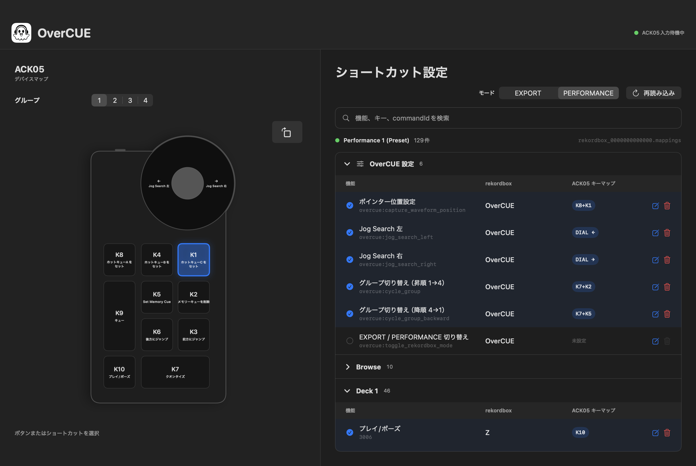

<nav class="language-nav">日本語 ・ <a href="../en/macos/">English</a> ・ <a href="../zh-hans/macos/">简体中文</a></nav>
<nav class="platform-nav"><a href="../">概要</a><span>・</span><strong>macOS</strong><span>・</span><a href="../windows/">Windows</a></nav>

# OverCUE for macOS

<p class="hero-lede">ACK05の10キーとダイヤルを、rekordboxのCue、Hot Cue、Jump、Quantize、波形操作へ割り当てます。Apple SiliconとIntelの両方に対応します。</p>



## 動作環境

| 項目 | 要件 |
| --- | --- |
| OS | macOS 13 Ventura以降 |
| Mac | Apple Silicon／Intel |
| デバイス | XPPen ACK05 Wireless Shortcut Remote |
| DJソフト | rekordbox 7 |

## ダウンロードと初回起動

1. [GitHub Releases](https://github.com/albasimia/OverCUE/releases/latest)から`OverCUE-vX.Y.Z-macos-universal.zip`をダウンロードします。
2. ZIPを展開し、`OverCUE.app`を「アプリケーション」へ移動します。
3. OverCUEを一度開き、macOSの警告を表示します。
4. 「システム設定」→「プライバシーとセキュリティ」を開き、OverCUEの「このまま開く」を選びます。
5. 確認画面でも「開く」を選びます。

<div class="notice">macOS版はDeveloper ID署名とApple公証を行っていません。Gatekeeper全体を無効にしたり、<code>xattr</code>で隔離属性を削除したりする必要はありません。</div>

## 必要な権限

初回起動後に、macOSの「プライバシーとセキュリティ」で次を許可してください。変更後はOverCUEを終了し、起動し直します。

- 入力監視：ACK05のキーとダイヤル入力を受け取るため
- アクセシビリティ：rekordboxへキーボード・マウス操作を送るため

XPPenPenTabletがACK05入力を消費する場合は終了してください。

## 基本的な使い方

1. rekordboxを起動します。
2. ACK05を接続してOverCUEを起動します。
3. グループとEXPORT／PERFORMANCEモードを選びます。
4. 波形ドラッグを使う場合は、rekordboxの拡大波形へポインターを置き、`K8+K1`で位置を保存します。
5. rekordboxを最前面にしてACK05を操作します。

キーボード・マウス出力はrekordboxが最前面のときだけ有効です。ウインドウを閉じても、メニューバーから動作を継続できます。

ショートカットの設定ファイルが見つからない場合、OverCUEはrekordbox標準の`Performance 1 (Preset)`または`Export (Preset)`を読み込みます。対象機能にショートカットがなければ推測送信は行いません。

## グループとモード

| グループ | 初期モード | 対象 |
| --- | --- | --- |
| 1 | PERFORMANCE | Deck 1 |
| 2 | PERFORMANCE | Deck 2 |
| 3 | EXPORT | Deck 1 |
| 4 | EXPORT | ユーザー設定用 |

各グループは最後に使用したモードと波形位置を保存します。グループ切替機能は全グループから使える共通割り当てです。

## デフォルトキーマップ

| 入力 | 操作 |
| --- | --- |
| K1 | Hot Cue C |
| K2 | Memory Cue削除 |
| K3 | 前方へJump（長押しで加速） |
| K4 | Hot Cue B |
| K5 | Memory Cue追加 |
| K6 | 後方へJump（長押しで加速） |
| K7 | Quantize ON/OFF |
| K8 | Hot Cue A |
| K9 | Cue |
| K10 | Play/Pause |
| ダイヤル左／右 | Jog Search左／右 |
| K8+K1 | 波形位置を保存 |
| K7+K8／K4／K1 | Hot Cue A／B／Cを削除 |
| K7+K3／K6 | 次／前のMemory Cue |
| K7+K2／K5 | グループを昇順／降順で切替 |
| K7+ダイヤル左／右 | Pitch Bend −／＋ |

グループ2では同じ物理配置でDeck 2の機能を使用します。グループ4は初期状態では空です。

## キーマッピングを編集する

ショートカット一覧の編集ボタンを押し、ACK05のキー、複数キーの同時押し、ダイヤル、またはキーを保持したダイヤル操作を入力します。

- rekordboxの割り当て済みショートカットをカテゴリ別に折りたたんで表示します。
- 機能名、キー、commandIdを検索できます。
- 既存入力を置き換える場合は上書き確認を表示します。
- デバイス図のボタンから対応項目へ移動でき、一覧の選択はデバイス図へ反映されます。
- デバイス図は90度単位で回転し、向きを保存できます。

## 言語と設定ファイル

画面とメニューバーは日本語、English、简体中文に対応します。「OverCUE」→「設定」から表示言語を変更できます。

```text
~/Library/Application Support/OverCUE/config.json
```

## トラブルシューティング

### ACK05入力が表示されない

- 入力監視の権限を確認し、OverCUEを起動し直します。
- XPPenPenTabletを終了します。
- ACK05を切断・再接続します。

### rekordboxが反応しない

- rekordboxを最前面にします。
- EXPORT／PERFORMANCEモードとグループを確認します。
- アクセシビリティ権限を確認します。
- 設定変更後はOverCUEの「再読み込み」を押します。

## プライバシーと安全性

OverCUEはテレメトリ、広告、アカウント機能、自動アップロードを実装していません。設定とUI状態はMac内に保存されます。公開ソースとReleaseの`SHA256SUMS.txt`を確認できます。

[OverCUEの概要へ戻る](../) ・ [Windows版の使い方](../windows/)
