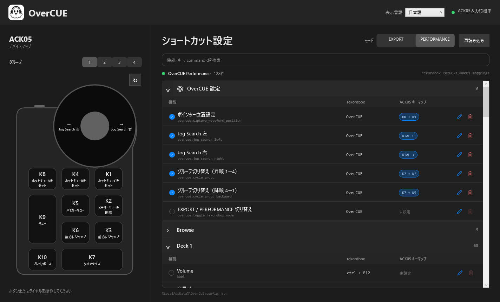

<nav class="language-nav">日本語 ・ <a href="../en/windows/">English</a> ・ <a href="../zh-hans/windows/">简体中文</a></nav>
<nav class="platform-nav"><a href="../">概要</a><span>・</span><a href="../macos/">macOS</a><span>・</span><strong>Windows</strong></nav>

# OverCUE for Windows

<p class="hero-lede">ACK05をWindows版rekordboxの専用操作デバイスへ。XPPen用設定とrekordbox用マッピングを同梱し、10キーとダイヤルをCue操作へ割り当てます。</p>



<div class="feature-grid">
  <section class="feature-card"><h3>設定ファイル同梱</h3><p>XPPenプロファイルとrekordboxマッピングをZIP内にまとめています。</p></section>
  <section class="feature-card"><h3>.NET導入不要</h3><p>.NET 10を同梱する自己完結型アプリとして配布します。</p></section>
  <section class="feature-card"><h3>タスクトレイ常駐</h3><p>ウインドウを閉じた後もタスクトレイから操作を継続できます。</p></section>
</div>

## 動作環境

| 項目 | 要件 |
| --- | --- |
| OS | Windows 10 22H2／Windows 11 |
| CPU | x64 |
| デバイス | XPPen ACK05 Wireless Shortcut Remote |
| DJソフト | rekordbox 7 |

## ダウンロードとインストール

1. [GitHub Releases](https://github.com/albasimia/OverCUE/releases/latest)から`OverCUE-vX.Y.Z-windows-x64.zip`をダウンロードします。
2. ZIPを任意のフォルダーへ展開します。ZIP内から直接起動しないでください。
3. 必要なら`SHA256SUMS.txt`と次のコマンドでファイルを確認します。

```powershell
Get-FileHash .\OverCUE-vX.Y.Z-windows-x64.zip -Algorithm SHA256
```

<div class="notice">Windows版はMicrosoft Storeを経由せず、コード署名なしで直接配布します。SmartScreenが表示された場合は、GitHub Releaseとチェックサムが一致することを確認してから「詳細情報」→「実行」を選んでください。SmartScreen全体を無効にする必要はありません。</div>

## 1. XPPenプロファイルを読み込む

1. XPPen Tablet、rekordbox、OverCUEを終了します。
2. XPPen Tabletの現在の設定をエクスポートしてバックアップします。
3. 展開したフォルダーの`Setup/XPPen/README.md`を確認します。
4. `Setup/XPPen/PenTablet_Config_2026-07-13.pcfg`をXPPen Tabletへインポートします。
5. ACK05を再接続します。

このプロファイルは現在のXPPen設定全体を置き換えます。必ず先にバックアップしてください。K1〜K10をF13〜F22、ダイヤル左／右をF23／F24へ割り当てます。これらはACK05とOverCUE間の専用入力で、rekordboxへ直接割り当てるキーではありません。

## 2. rekordboxマッピングを読み込む

1. rekordboxを起動し、「環境設定」→「キーボード」を開きます。
2. `Setup/rekordbox/README.md`に従い、`OverCUE-Performance.mappings`をインポートします。
3. PERFORMANCEマッピングとして選択されていることを確認します。
4. rekordboxを再起動します。

## 3. OverCUEを起動する

1. rekordboxを起動します。
2. `OverCUE.Windows.exe`を実行します。
3. 画面右上で言語を選び、グループとEXPORT／PERFORMANCEモードを確認します。
4. rekordboxを最前面にしてACK05を操作します。

波形ドラッグを使う場合は、rekordboxの拡大波形へポインターを置いて`K8+K1`で位置を保存します。キーボード・マウス出力はrekordboxが最前面のときだけ有効です。

ショートカット設定が見つからない場合は、rekordbox標準の`Performance 1 (Preset)`または`Export (Preset)`を読み込みます。対象機能に割り当てがなければ推測送信は行いません。

## グループとモード

| グループ | 初期モード | 対象 |
| --- | --- | --- |
| 1 | PERFORMANCE | Deck 1 |
| 2 | PERFORMANCE | Deck 2 |
| 3 | EXPORT | Deck 1 |
| 4 | EXPORT | ユーザー設定用 |

各グループはモードと波形位置を保存します。

## デフォルトキーマップ

| 入力 | 操作 |
| --- | --- |
| K1／K4／K8 | Hot Cue C／B／A |
| K2／K5 | Memory Cue削除／追加 |
| K3／K6 | 前方／後方へJump（長押しで加速） |
| K7 | Quantize ON/OFF |
| K9／K10 | Cue／Play・Pause |
| ダイヤル左／右 | Jog Search左／右 |
| K8+K1 | 波形位置を保存 |
| K7+K8／K4／K1 | Hot Cue A／B／Cを削除 |
| K7+K3／K6 | 次／前のMemory Cue |
| K7+K2／K5 | グループを昇順／降順で切替 |
| K7+ダイヤル左／右 | Pitch Bend −／＋ |

## キーマッピングを編集する

rekordboxの割り当て済みショートカットをカテゴリ別の折りたたみ一覧で確認できます。機能名、キー、commandIdで検索し、編集ボタンを押してからACK05入力を行います。デバイス図と一覧は相互に選択位置を示し、デバイスの向きも90度単位で保存できます。

## 言語と設定ファイル

画面右上の「表示言語」から日本語、English、简体中文を切り替えられます。選択は次回起動時も保持されます。

```text
%LocalAppData%\OverCUE\config.json
```

## トラブルシューティング

### ACK05入力が表示されない

- XPPenプロファイルが読み込まれ、K1〜K10がF13〜F22になっているか確認します。
- ACK05を再接続し、OverCUEを起動し直します。
- OverCUEが最前面のときだけ入力されない場合も、最新版へ更新してください。

### キーは表示されるがrekordboxが動かない

- rekordboxを最前面にします。
- EXPORT／PERFORMANCEモードとグループを確認します。
- `OverCUE-Performance.mappings`が現在のPERFORMANCEマッピングとして選択されているか確認します。
- 設定変更後にOverCUEの「再読み込み」を押します。
- OverCUEとrekordboxは同じ権限レベルで起動します。通常は両方とも管理者権限なしで使用します。

## プライバシーと安全性

OverCUEはテレメトリ、広告、アカウント機能、自動アップロードを実装していません。設定とUI状態はPC内に保存されます。

[OverCUEの概要へ戻る](../) ・ [macOS版の使い方](../macos/)
