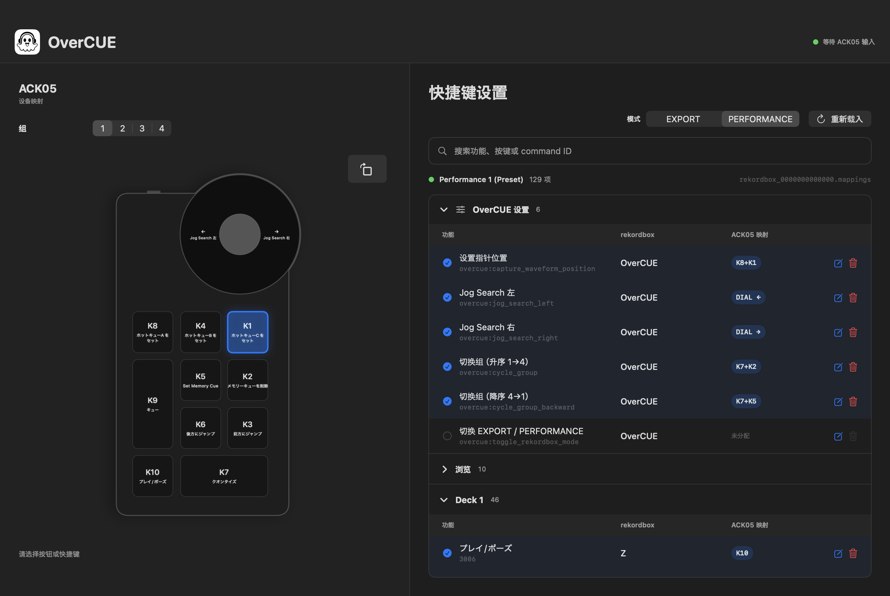

<nav class="language-nav"><a href="../">日本語</a> ｜ <a href="../en/">English</a> ｜ 简体中文</nav>

# OverCUE

OverCUE 是一款常驻 macOS 应用，可将 XPPen ACK05 的旋钮和十个按键转换为 rekordbox 的 CUE 准备操作。它通过鼠标和键盘输出工作，可用于 rekordbox Free 方案。



<a class="download-button" href="https://github.com/albasimia/OverCUE/releases/latest/download/OverCUE-v0.1.0-macos-universal.zip">下载 OverCUE v0.1.0</a>

## 系统要求

- macOS 13 Ventura 或更高版本
- Apple 芯片或 Intel Mac
- XPPen ACK05 Wireless Shortcut Remote
- rekordbox 7

## 安装

<div class="notice">
此版本未使用 Apple Developer Program，未进行 Developer ID 签名或 Apple 公证，因此 macOS 会在首次启动时显示警告。
</div>

1. 解压 ZIP 文件。
2. 将 `OverCUE.app` 移动到“应用程序”文件夹。
3. 尝试打开一次 OverCUE，让 macOS 显示警告。
4. 打开“系统设置”→“隐私与安全性”。
5. 在“安全性”中为 OverCUE 点击“仍要打开”。
6. 再次点击“打开”确认。

无需关闭 Gatekeeper，也不要用 `xattr` 删除隔离属性。可使用 Release 中的 `SHA256SUMS.txt` 验证下载文件。

```sh
shasum -a 256 OverCUE-v0.1.0-macos-universal.zip
```

## 首次设置

OverCUE 使用以下 macOS 权限：

- 输入监控：接收 ACK05 按键和旋钮输入
- 辅助功能：向 rekordbox 发送键盘和鼠标操作

请按照首次启动提示，在系统设置中向 OverCUE 授予这两项权限，然后退出并重新打开应用。如果 XPPenPenTablet 占用了 ACK05 输入，请将其退出。重新连接 ACK05 后再启动 OverCUE 也可能解决问题。

## 基本使用方法

1. 启动 rekordbox。
2. 连接 ACK05 并启动 OverCUE。
3. 选择 OverCUE 分组以及 EXPORT 或 PERFORMANCE 模式。
4. 如需控制波形，请将指针放在放大的波形上，并按 `K8+K1` 保存位置。
5. 将 rekordbox 切换到最前方后操作 ACK05。

只有 rekordbox 位于最前方时，键盘和鼠标输出才会生效。关闭窗口后，OverCUE 仍可通过菜单栏的 👻 图标继续运行。

## 分组与模式

| 分组 | 默认模式 | 目标 |
| --- | --- | --- |
| 1 | PERFORMANCE | Deck 1 |
| 2 | PERFORMANCE | Deck 2 |
| 3 | EXPORT | Deck 1 |
| 4 | EXPORT | 可用于自定义映射 |

每个分组都会保存最后使用的 EXPORT 或 PERFORMANCE 模式。GUI、ACK05、CLI 桥接和菜单栏中的分组与模式会保持同步。

## 默认按键映射

| 输入 | 操作 |
| --- | --- |
| K1 | Hot Cue C |
| K2 | 删除 Memory Cue |
| K3 | 向后跳转（长按加速重复） |
| K4 | Hot Cue B |
| K5 | 添加 Memory Cue |
| K6 | 向前跳转（长按加速重复） |
| K7 | Quantize 开/关 |
| K8 | Hot Cue A |
| K9 | Cue（按住时播放） |
| K10 | 播放/暂停 |
| 旋钮左/右 | Jog Search 左/右 |
| K8+K1 | 保存波形位置 |
| K7+K8/K4/K1 | 删除 Hot Cue A/B/C |
| K7+K3/K6 | 下一个/上一个 Memory Cue |
| K7+K2 | 正向切换分组 |
| K7+K5 | 反向切换分组 |
| K7+旋钮左/右 | Pitch Bend −/＋ |

## 编辑映射

点击快捷键列表中的编辑按钮，然后操作 ACK05 的单个按键、任意数量的组合键、旋钮方向，或按住按键并旋转旋钮。

- 输入已被占用时，会先确认是否覆盖。
- 与长按功能冲突的组合不会保存，并会显示原因。
- 点击设备图中的按键或旋钮左右区域，会选择并滚动到对应快捷键。
- 列表或设备选择显示为蓝色；实际硬件输入显示为绿色。
- rekordbox 功能名称使用其按键映射文件中保存的语言。

设置保存在：

```text
~/Library/Application Support/OverCUE/config.json
```

## 故障排除

### 无法打开 ACK05

- 退出 XPPenPenTablet。
- 断开并重新连接 ACK05。
- 检查 OverCUE 的输入监控权限。
- 退出并重新启动 OverCUE。

### rekordbox 没有响应

- 将 rekordbox 切换到最前方。
- 检查 OverCUE 的辅助功能权限。
- 确认 rekordbox 已为目标功能分配快捷键。
- 检查当前 EXPORT/PERFORMANCE 模式和分组。

### 更新后无法工作

由于应用使用临时签名，替换应用后可能需要重新授予输入监控和辅助功能权限。请在系统设置中删除旧的 OverCUE 项目，然后添加新应用。

## 隐私与安全

<div class="safe">
OverCUE 不包含遥测、广告、账户系统或自动上传功能。配置仅保存在您的 Mac 上。
</div>

发布的 ZIP 未经过 Apple 公证或恶意软件扫描。使用前请验证校验和并查看公开源代码。

## 许可证与商标

OverCUE 使用 [MIT License](https://github.com/albasimia/OverCUE/blob/main/LICENSE) 发布。

OverCUE 是独立的非官方项目，与 XPPen、AlphaTheta 或 rekordbox 无附属或认可关系。产品名称和商标归各自权利人所有。

实现细节请参阅 [GitHub 仓库](https://github.com/albasimia/OverCUE)。
