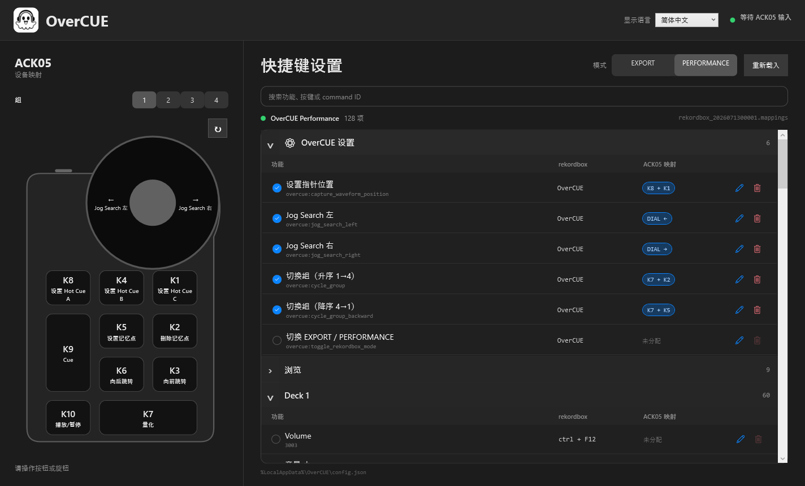

<nav class="language-nav"><a href="../../windows/">日本語</a> ・ <a href="../../en/windows/">English</a> ・ 简体中文</nav>
<nav class="platform-nav"><a href="../">概要</a><span>・</span><a href="../macos/">macOS</a><span>・</span><strong>Windows</strong></nav>

# OverCUE for Windows

<p class="hero-lede">将 ACK05 变成 Windows 版 rekordbox 的专用控制器。安装包包含 XPPen 配置与 rekordbox 映射，可将十个按键和旋钮用于 CUE 操作。</p>



<div class="feature-grid">
  <section class="feature-card"><h3>附带设置文件</h3><p>ZIP 中同时包含 XPPen 配置文件和 rekordbox 映射。</p></section>
  <section class="feature-card"><h3>无需安装 .NET</h3><p>自包含应用附带所需的 .NET 10 运行时。</p></section>
  <section class="feature-card"><h3>驻留系统托盘</h3><p>关闭窗口后仍可从系统托盘继续使用。</p></section>
</div>

## 系统要求

| 项目 | 要求 |
| --- | --- |
| 操作系统 | Windows 10 22H2／Windows 11 |
| CPU | x64 |
| 设备 | XPPen ACK05 Wireless Shortcut Remote |
| DJ 软件 | rekordbox 7 |

## 下载与安装

1. 从 [GitHub Releases](https://github.com/albasimia/OverCUE/releases/latest) 下载 `OverCUE-vX.Y.Z-windows-x64.zip`。
2. 解压到任意文件夹，不要直接在 ZIP 内运行。
3. 如需验证文件，请与 `SHA256SUMS.txt` 比较：

```powershell
Get-FileHash .\OverCUE-vX.Y.Z-windows-x64.zip -Algorithm SHA256
```

<div class="notice">Windows 版不经过 Microsoft Store，目前也没有代码签名。如出现 SmartScreen，请先确认 GitHub Release 与校验值，再选择“更多信息”→“仍要运行”。无需全局关闭 SmartScreen。</div>

## 1. 导入 XPPen 配置

1. 退出 XPPen Tablet、rekordbox 和 OverCUE。
2. 导出当前 XPPen 设置作为备份。
3. 阅读解压目录中的 `Setup/XPPen/README.md`。
4. 将 `Setup/XPPen/PenTablet_Config_2026-07-13.pcfg` 导入 XPPen Tablet。
5. 重新连接 ACK05。

导入会替换当前全部 XPPen 设置，因此请先备份。配置将 K1～K10 映射到 F13～F22，将旋钮左／右映射到 F23／F24。这些是 ACK05 与 OverCUE 之间的专用输入，请勿直接分配给 rekordbox。

## 2. 导入 rekordbox 映射

1. 启动 rekordbox，打开“首选项”→“键盘”。
2. 按照 `Setup/rekordbox/README.md` 导入 `OverCUE-Performance.mappings`。
3. 确认其已被选为当前 PERFORMANCE 映射。
4. 重新启动 rekordbox。

## 3. 启动 OverCUE

1. 启动 rekordbox。
2. 运行 `OverCUE.Windows.exe`。
3. 在右上角选择语言，并确认分组和 EXPORT／PERFORMANCE 模式。
4. 将 rekordbox 置于前台后操作 ACK05。

如需拖动波形，将指针放到 rekordbox 的放大波形上，按 `K8+K1` 保存位置。键盘与鼠标输出仅在 rekordbox 位于前台时有效。

如果找不到快捷键文件，OverCUE 会回退到 `Performance 1 (Preset)` 或 `Export (Preset)`。

## 分组与默认映射

| 分组 | 初始模式 | 目标 |
| --- | --- | --- |
| 1 | PERFORMANCE | Deck 1 |
| 2 | PERFORMANCE | Deck 2 |
| 3 | EXPORT | Deck 1 |
| 4 | EXPORT | 用户设置 |

| 输入 | 操作 |
| --- | --- |
| K1／K4／K8 | Hot Cue C／B／A |
| K2／K5 | 删除／设置 Memory Cue |
| K3／K6 | 向前／向后 Jump，长按加速 |
| K7 | Quantize 开／关 |
| K9／K10 | Cue／Play・Pause |
| 旋钮左／右 | Jog Search 左／右 |
| K8+K1 | 保存波形位置 |
| K7+K8／K4／K1 | 删除 Hot Cue A／B／C |
| K7+K3／K6 | 下一个／上一个 Memory Cue |
| K7+K2／K5 | 下一个／上一个分组 |
| K7+旋钮左／右 | Pitch Bend −／＋ |

## 编辑映射

已分配的 rekordbox 快捷键按可折叠类别显示。可以按功能名称、按键或 commandId 搜索，点击编辑后输入 ACK05 操作。设备图与列表会互相高亮，并保存 90 度方向设置。

## 语言与配置文件

从右上角的“显示语言”选择日本語、English、简体中文，选择会保留到下次启动。

```text
%LocalAppData%\OverCUE\config.json
```

## 故障排除

- 没有 ACK05 输入：确认 K1～K10 已映射为 F13～F22，重新连接 ACK05 并重启 OverCUE。
- 有输入但 rekordbox 无响应：将 rekordbox 置于前台，检查分组与模式，确认已选择 `OverCUE-Performance.mappings`，修改设置后点击“重新加载”。
- OverCUE 与 rekordbox 应以相同权限级别运行，通常都不使用管理员权限。

## 隐私与安全

OverCUE 不包含遥测、广告、账户功能或自动上传。设置与界面状态仅保存在电脑内。

[返回概要](../) ・ [macOS 使用指南](../macos/)
